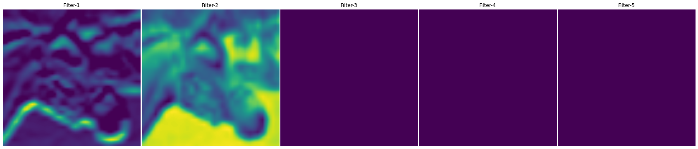

<h1 align="center">
  AlexNet-Visualization
</h1>
 <h3 align="center">
  Visualizing layer output of AlexNet model trained on cifar-10 dataset
</h3>

## Architecture

<a href='https://papers.nips.cc/paper/4824-imagenet-classification-with-deep-convolutional-neural-networks'>Official Paper</a>

  
  

  
  
## Model Summary

Trained on cifar-10 dataset
#### Performance
  loss: 0.5992 - accuracy: 0.8075 - val_loss: 1.3247 - val_accuracy: 0.7012(*Trained for 18 epochs*)
#### Summary
  

## Visualization

#### Original Image
 
 
#### Layer-1(conv2D)
*Below are first five filters of Layer-1 resized to (224,224) pixels*

 
 
#### Layer-4(conv2D)
*Below are first five filters of Layer-4 resized to (224,224) pixels*

 
 
 #### Layer-7(conv2D)
 *Below are random five filters of Layer-7 resized to (224,224) pixels*
 
 
 
 #### Layer-11(conv2D)
 *Below are first five filters of Layer-11 resized to (224,224) pixels*
 
  
 
 
 ### Try it yourself on different images on google colab or on local system by using checkpoint.zip and <a href='https://github.com/ishanExtreme/AlexNet-Visualization/blob/master/AlexNet.ipynb'>AlexNet.ipynb</a> in the repository

